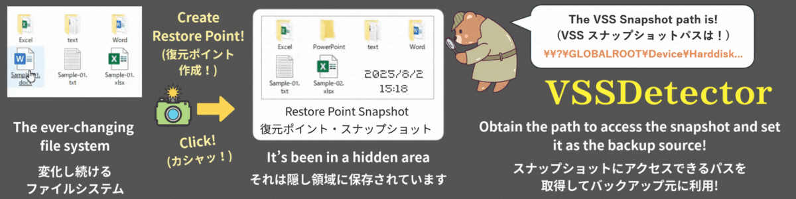

# VSSDetector Ver.2.0.2





### VSS Snapshot Universal Path Extraction Tool
### **VSS スナップショットパス抽出ツール**

**🌍 English-Japanese** (英語 - 日本語) **README**

- If you would like to view the Japanese version, please jump to ▶ <a href="#Japanese-Version">here</a>.  
This README is structured with the English version followed by the Japanese version. 

- **日本語版をご覧になる場合は ▶<a href="#Japanese-Version">こちら</a>からから該当部分にジャンプしてください。**  
  本READMEは英語版の文章に続けて日本語版のREADMEの文章を組み合わせた構成になっています。

---

## English Version

=================================================

# Chall-Link "VSSDetector" - VSS Snapshot Universal Path Acquisition Tool  
## English Version Ver.2.0.2  
## Unlocking Windows Hidden Features for Everyone  
## Advanced VSS Utilization Utility  

**Copyright:** Chall-Link  
**Development:** Developed in Japan  
**License:** MIT License  
**Type:** Free Software (Open Source)  

=================================================  
💡 This document uses "archive," "backup," and "compression" with similar meanings  
💡 "Snapshot" is also referred to as "shadow copy"

&emsp; 

---
## ■Overview: Revolutionary Breakthrough - The Secret Location Hidden in Your Windows

With Chall-Link "VSSDetector," anyone can easily access Windows snapshots directly with software like 7-zip. These snapshots represent "static (unchanging) drives/folders/files at any point in the past." Previously, this functionality was mainly accessible only through Windows itself and commercial software.

&nbsp;

---
## Please Read First

When running this script for the first time, Windows security features may display warning messages. This is a standard confirmation that Windows performs for new files downloaded from the internet, and it does not mean the script has been determined to be dangerous. Please be assured that such warnings may appear during initial execution of any safe file.

**About Script Safety**
This program is an open-source script in text format, and anyone can verify its contents.
It has been confirmed safe by ESET security software and internet virus detection services (using 61 virus detection engines) as of July 30, 2025.

After reviewing the warning content and confirming the script's safety, please follow the steps below to execute:

**Execution Steps After Warning Confirmation**

**Case 1**: When "Windows protected your PC" is displayed

1. Click "More info" in the warning screen.
2. Then click the "Run anyway" button.

*Once you execute using these steps, this warning screen will not appear again.

**Case 2**: When "Publisher could not be verified. Do you want to run this software?" is displayed

1. Uncheck "Always ask before opening this file" (W).
2. Click the "Run" button.

*If the Run button does not respond immediately, please wait a moment and click again.

&emsp; 

---
## ■File Structure
VSSDetector/  
├── ChaL-VSSDetector-en.bat      # English version - Main script  
├── ChaL-VSSDetector-ja.bat         # Japanese version - Main script  
├── README-en.md                 # English version - Documentation  
├── README.md                    # Japanese version - Documentation  
└── docs/  
&nbsp;&nbsp;&nbsp;&nbsp;&nbsp;&nbsp;&nbsp;&nbsp;├── advanced-backup-guide-en.md # English version - Usage guide  
&nbsp;&nbsp;&nbsp;&nbsp;&nbsp;&nbsp;&nbsp;&nbsp;├── advanced-backup-guide.md    # Japanese version - Usage guide  
&nbsp;&nbsp;&nbsp;&nbsp;&nbsp;&nbsp;&nbsp;&nbsp;└── pdf/  
&nbsp;&nbsp;&nbsp;&nbsp;&nbsp;&nbsp;&nbsp;&nbsp;&nbsp;&nbsp;&nbsp;&nbsp;&nbsp;&nbsp;&nbsp;&nbsp;├── advanced-backup-guide-en.pdf # English version - Usage guide PDF  
&nbsp;&nbsp;&nbsp;&nbsp;&nbsp;&nbsp;&nbsp;&nbsp;&nbsp;&nbsp;&nbsp;&nbsp;&nbsp;&nbsp;&nbsp;&nbsp;├── advanced-backup-guide.pdf    # Japanese version - Usage guide PDF  
&nbsp;&nbsp;&nbsp;&nbsp;&nbsp;&nbsp;&nbsp;&nbsp;&nbsp;&nbsp;&nbsp;&nbsp;&nbsp;&nbsp;&nbsp;&nbsp;├── README-en.pdf                # English version - Documentation PDF  
&nbsp;&nbsp;&nbsp;&nbsp;&nbsp;&nbsp;&nbsp;&nbsp;&nbsp;&nbsp;&nbsp;&nbsp;&nbsp;&nbsp;&nbsp;&nbsp;└── README.pdf                   # Japanese version - Documentation PDF  

> Files with `.md` extension are Markdown files that are automatically displayed in a readable format on GitHub.  
> If they are difficult to read locally, please use the PDF files in the `docs/pdf/` directory.

&nbsp;

---

## ■System Requirements
- **Download Link**: Please download "Source code (zip)" from [https://github.com/Chall-Link/VSSDetector/releases/latest](https://github.com/Chall-Link/VSSDetector/releases/latest). Please note that downloading via GitHub Raw will result in LF line endings and the script will not work properly.
- **Character Encoding & Line Endings**: When using the Japanese version (ChaL-VSSDetector-ja.bat), this script requires Shift-JIS encoding and CRLF line endings to function properly on Japanese Windows systems.
- Windows 10 Pro 64bit (tested), theoretically compatible with Windows 7 SP1 or later (untested, use at your own risk)
- **Requirements**: PowerShell 2.0 or later (included with Windows), Administrator privileges, VSS service enabled

&nbsp;

---
## ■ Related Software & Integration Tools (Optional)

- **Recommended Software**: 7-Zip (LGPL License)  (available from [https://www.7-zip.org/](https://www.7-zip.org/))

- **For using 7-Zip with VSS snapshots as backup sources to backup large-capacity drives and folders**: 
  - VSSDetector sister software Chall-Link "PreFAS Backup"  
    Details: [https://github.com/Chall-Link/PreFAS-Backup#readme](https://github.com/Chall-Link/PreFAS-Backup#readme)  
    Download Page: [https://github.com/Chall-Link/PreFAS-Backup/releases/latest](https://github.com/Chall-Link/PreFAS-Backup/releases/latest)  

&nbsp;

---

&nbsp;

**👉 `**This script makes VSS functionality accessible to everyone!**`**

&nbsp;

---
## ■Experience: Basic Usage - Let's Experience It First. The Amazing Moment! 

### ■ 3-Minute Amazing Experience 
> ⚠️ This section only explains how to use VSSDetector. As a prerequisite, restore points must be created beforehand. However, this script only provides information retrieval functionality, so running it without restore points will simply display "Restore points may not have been created" without affecting your system.  
> If you're unsure, feel free to run it anyway. For detailed procedures including restore point creation, please refer to the separate usage guide ([advanced-backup-guide.md](https://github.com/Chall-Link/VSSDetector/blob/main/docs/advanced-backup-guide.md)).  
> Please consult with your PC administrator and obtain permission before creating new restore points.

1. Right-click ChaL-VSSDetector-ja.bat and run as administrator

2. Snapshot information in your system will be automatically analyzed and saved to output file:
Analysis result file: ChaL-RESULT-VSSDetector.txt
```
   ────────────────────────────
[1] HarddiskVolumeShadowCopy3 (Drive D:)
    Creation Time: 2025/06/15 18:28:17
    Type: System Restore Point
    Full Drive Path: \\?\GLOBALROOT\Device\HarddiskVolumeShadowCopy3\*
    Folder Path: \\?\GLOBALROOT\Device\HarddiskVolumeShadowCopy3\(FolderName) 
   ────────────────────────────
```
> Please only use snapshots with "Type: System Restore Point" as others are created by various software

&nbsp; 

**👉 `You've now obtained VSSDetector VSS paths!`**

&nbsp;

> ⚠️ The following experience requires 7-Zip  [https://www.7-zip.org/](https://www.7-zip.org/).  
> Please install it if needed.

&nbsp;

3. Copy the required VSSDetector VSS path and use it with other tools

&emsp; &emsp; 👉 **`Let's use 7-Zip File Manager to peek inside VSS snapshots!`**

4. Copy the "Full Drive Path" from step 2, **excluding the final \***

5. Launch 7-Zip File Manager
6. Paste the VSS path into the address bar and press Enter

&nbsp;

**👉 `A snapshot of files and folders from a past point in time has appeared!`**

&nbsp;

> ⚠️ To avoid trouble, please only browse and do not perform other operations.

&nbsp;

---
## ■Features: Excellent Characteristics of VSSDetector  
### ● Complete Visibility of Hidden Snapshots
- Automatically detects all snapshots stored in the system
- Properly identifies creation time, target drive, and source automatically

### ● Automatic Generation of Practical VSS Paths
- Automatically provides VSS path formats directly usable with 7-zip
- Complete support for both full drive and folder specification patterns
- Ready for immediate use with other tools via copy & paste

### ● Always Accessible Result File Output
- Saves to text file (ChaL-RESULT-VSSDetector.txt) simultaneously with screen display
- Includes important notes
- Rich error handling

&nbsp;

---
## ■Backup: Application to Backup Processing
### Benefits of Using VSS for Backup

Using VSS as a backup source means you can use static, unchanging drive/folder images as sources.  
For example, when using actual folders as sources, file editing work in the original folder was impossible during backup processing, requiring work to be suspended until completion. Simultaneous work could cause backup failures.
VSSDetector unlocks VSS functionality and solves this challenge.

For large-scale processing like backing up entire drives with 7-Zip, it's impossible to continue both backup and editing work simultaneously.  
Running 7-Zip continuously for days requires different operational comfort considerations than processing that takes minutes.  

This led to the development of the separate script Chall-Link "PreFAS Backup."
Using VSSDetector and PreFAS Backup together, scripts are optimized to enable continued editing work while performing multi-day backup processing using VSS.

Additionally, PreFAS Backup is designed with the concept of long-term safe storage of valuable files, aiming to protect precious files from disasters by storing created encrypted backup files on cloud storage or M-Disc (100-year durable optical discs).

&nbsp;

---
## ■Applications: PreFAS Backup Usage Scenarios
- **Photo & Video Management** / Complete protection of precious recorded photos and private memories
- **Creators & Designers** / Reliable long-term storage of completed works
- **Software Developers** / Strategic backup of stable program versions
- **Document Creation & Office Work** / Reliable protection of important documents and literary works
- **System Administration & IT Personnel** / Deep understanding of VSS and application to system maintenance

&nbsp;

---
## ■Important Notes

### ■ Critical Considerations
- Deletion of "System Restore and Shadow Copies" during disk cleanup while using VSS paths  
- For full drive specification, "\*" at the end is required; for folder specification, replace (folder name) with actual name
- When using 7-Zip File Manager, remove the final * from the full drive path when entering it in the path field

### ■ Troubleshooting
- "Restore points may not have been created" → Restore points not created, or VSS service may be stopped
- "Administrator privileges required" → Launch with "Run as administrator" from right-click menu

**👉 `With Chall-Link "VSSDetector," you can achieve results previously only obtainable with expensive commercial backup software using free software`**

&emsp; 

---
## ■Expanding Application Possibilities

Chall-Link "VSSDetector" can be applied to various fields:
- **Security & Auditing** (File & Backup)  
- **System Administration & Operations** (Troubleshooting system failures)  
- **Disk Analysis & Optimization Tools** (Comparing old and new folder states)  

### ● Backup Applications
- Use snapshots as backup sources, enabling continued work with actual files during archive processing
    - Achieve previously impossible VSS copying with Chall-Link "PreFAS" (large-scale), 7-Zip (small-scale), robocopy, xcopy, etc.

### ● File Comparison & Recovery
- Compare content between past (snapshot) and present (actual files)
- Compare content between past (snapshot) and present (actual folders)

### ● Past File Extraction
- Restore lost files from snapshots
- Extract past versions of files from snapshots

### ● Applications with Other Tools
- Integration into automated batch file processing
- Collaboration with PowerShell scripts

### ● Enterprise & Professional Use
- Automation of regular backup processing
- Application in system administration tasks
- Powerful tool for data recovery operations

&emsp; 

---
##  ■License & Disclaimer
This software is free software (MIT License). Copyright belongs to Chall-Link.
The author assumes no responsibility for any damage or issues arising from the use of this software.  
Redistribution is free, but please cite "Chall-Link 'VSSDetector'" as the source.

Please submit feedback and comments to the GitHub repository [Issues](https://github.com/Chall-Link/VSSDetector/issues).  
Code reviews and improvement suggestions are also welcome.  
However, we do not provide individual support or responses.  

&nbsp;

---
## ■Tags
VSS, snapshot, restore-point, 7zip, PowerShell, vssadmin, system-administration, windows-tools, large-data, backup

&nbsp;
&nbsp;
&nbsp;

---

<h2 id="Japanese-Version">Japanese Version</h2>
=================================================

# Chall-Link「VSSDetector」 - VSS スナップショット 汎用パス取得ツール

## 日本語版 Ver.2.0.2

## Windowsの隠れた機能を誰でも使えるように機能解放  
## 先進的 VSS活用ユーティリティ  

**【著作権者】** Chall-Link（シャルリンク）  
**【開発地】** Developed in Japan  
**【ライセンス】** MIT License  
**【種別】** フリーソフトウェア（オープンソース）  

=================================================  
💡 本ドキュメントでは「アーカイブ」「バックアップ」「圧縮」をほぼ同じ意味として混在使用しています  
💡 「スナップショット」は「シャドーコピー」とも呼ばれます

&emsp; 

---
## ■概要：画期的なブレークスルー：あなたのWindowsに眠る秘密の場所

Chall-Link「VSSDetector」を使えば、Windowsのスナップショット＝「過去の任意の時点での静的な（変化しない）ドライブ／フォルダ／ファイル」に7-zipなどのソフトウェアから誰でも簡単に直接アクセスできるようになります。
従来、この機能は主にWindowsおよび市販ソフト経由などでしか使えませんでした。  

&nbsp;

---
## 【最初にご確認ください】

このスクリプトを初めて実行する際に、Windowsのセキュリティ機能が警告を表示する場合があります。これは、インターネットからダウンロードされた新しいファイルに対してWindowsが標準的に行う確認であり、スクリプトが危険なものと判断されたわけではありません。どんなに安全なファイルでも、初回実行時にはこのような警告が表示されることがありますのでご安心ください。

**＜本スクリプトの安全性について＞**
本プログラムはテキスト形式のオープンソーススクリプトであり、誰でも内容を確認できます。
セキュリティソフトESETおよびインターネット上のウイルス検知サービス（61種類のウイルス検知エンジンを利用）にて、無害であることが確認済みです（2025年7月30日確認）。

警告内容とスクリプトの安全性をご確認いただいた上で、以下の手順で実行してください。

**＜警告確認後の実行手順＞**

**ケース１**：『WindowsによってPCが保護されました』と表示された場合

1.  警告画面内の「詳細情報」をクリックしてください。
2.  続けて「実行」ボタンをクリックしてください。
※ 一度この手順で実行すると、以降この警告画面は表示されなくなります。

**ケース２**：『発行元を確認できませんでした。このソフトウェアを実行しますか？』と表示された場合

1.  「このファイルを開く前に常に確認する(W)」のチェックを外してください。
2.  「実行」ボタンをクリックしてください。
    ※ 実行ボタンをクリックしても一時的に反応がない場合があります。その際は少し待ってから再度クリックしてください。

&emsp; 

---
## ■ファイル構成
VSSDetector/  
├── ChaL-VSSDetector-ja.bat         # 日本語版・メインスクリプト  
├── ChaL-VSSDetector-en.bat      # 英語版・メインスクリプト  
├── README.md                    # 日本語版・説明書  
├── README-en.md                 # 英語版・説明書  
└── docs/  
&emsp; &emsp;├── advanced-backup-guide.md    # 日本語版・活用ガイド  
&emsp; &emsp;├── advanced-backup-guide-en.md # 英語版・活用ガイド  
&emsp; &emsp;└── pdf/  
&emsp; &emsp;&emsp; &emsp;├── advanced-backup-guide.pdf    # 日本語版・活用ガイド PDF  
&emsp; &emsp;&emsp; &emsp;├── advanced-backup-guide-en.pdf # 英語版・活用ガイド PDF  
&emsp; &emsp;&emsp; &emsp;├── README.pdf                   # 日本語版・説明書 PDF  
&emsp; &emsp;&emsp; &emsp;└── README-en.pdf                # 英語版・説明書 PDF  

> 拡張子 `.md` はマークダウンファイルです。GitHub上では自動的に見やすく表示されます。  
> ローカルで読みにくい場合は、`docs/pdf/` の PDF ファイルをご利用ください。

&nbsp;

---
## ■ 動作環境
- **ダウンロードリンク**:  [https://github.com/Chall-Link/VSSDetector/releases/latest](https://github.com/Chall-Link/VSSDetector/releases/latest) 掲載の「Source code (zip)」をダウンロードしてください。GitHubの Rawダウンロード でダウンロードすると改行コードがLFになり動作しませんのでご注意ください。 
- **文字コード・改行コード**: 本スクリプトは日本語対応のWindowsスクリプトで、Shift-JISエンコーディングとCRLF改行コードでなければ正常に動作しません。
- Windows10 Pro 64bit（動作確認済み）、理論上はWindows7 SP1以上で動作可能（未確認のため自己責任でテスト推奨）
- **必要条件**: PowerShell 2.0以上（Windows標準搭載）、管理者権限、VSSサービスが有効

&nbsp;

---
## ■ 関連ソフト・連携ツール（オプション）
- **併用推奨ソフト**: 7-Zip（LGPLライセンス）（[https://www.7-zip.org/](https://www.7-zip.org/) から入手）  
- **7-ZipでVSSスナップショットをバックアップ元にして大容量ドライブ・フォルダをバックアップする場合** 
  -  VSSDetector 姉妹ソフト Chall-Link「PreFAS Backup」  
    ＜詳細情報＞ [https://github.com/Chall-Link/PreFAS-Backup#readme](https://github.com/Chall-Link/PreFAS-Backup#readme)  
    ＜ダウンロードページ＞ [https://github.com/Chall-Link/PreFAS-Backup/releases/latest](https://github.com/Chall-Link/PreFAS-Backup/releases/latest)  

&nbsp;

---
## ■体験：基本的な使い方　～まずは体験してみよう。驚きの瞬間！～ 

### ■ 3分でできる感動体験 
> ⚠️ ここではVSSDetectorの使い方のみを説明します。前提条件として事前に復元ポイントが作成されている必要がありますが、このスクリプトは情報取得機能のみで復元ポイントが無い状態で実行しても「復元ポイントが作成されていない可能性があります」というメッセージが出るだけでシステムに影響を及ぼす事はありません。  
> わからない場合、とりあえず実行してみていただいても問題ございません。復元ポイント作成など詳しい手順は別の活用ガイド( [advanced-backup-guide.md](https://github.com/Chall-Link/VSSDetector/blob/main/docs/advanced-backup-guide.md) )を参照ください。  
> なお、新たに復元ポイントを作成して良いかなどは、PCの管理者と相談し許可を得てください。

1. ChaL-VSSDetector-ja.batを右クリックして管理者権限で実行

2. システム内のスナップショット情報が自動解析され、以下の形式で表示：
```
   ────────────────────────────
   [1] HarddiskVolumeShadowCopy3 (ドライブ D:)
       作成日時: 2024/06/06 14:30:25
       種類: システム復元ポイント
       ドライブ全体指定時パス表記: \\?\GLOBALROOT\Device\HarddiskVolumeShadowCopy3\*
       フォルダ指定時パス表記: \\?\GLOBALROOT\Device\HarddiskVolumeShadowCopy3\(フォルダ名)
   ────────────────────────────
```
> 結果はChaL-RESULT-VSSDetector.txtファイルにも保存されています  
> 「種類: システム復元ポイント」以外の物は各種ソフトが作成した物なので利用しないで下さい

&nbsp; 

**👉 `これで、VSSDetector VSSパス を取得する事ができました！ `**

&nbsp;

> ⚠️ ここから先の体験は、別途 7-Zip（  [https://www.7-zip.org/](https://www.7-zip.org/) ) が必要となります。  
> 必要に応じてインストールして下さい。

&nbsp;

3. 必要な VSSDetector VSSパスをコピーして、他のツールで使用

&emsp; &emsp; 👉 **`ここでは、7-Zip File Manager を使って VSSのスナップショットの中を覗いてみましょう！`**

4. 2\. のドライブ全体指定時パス表記 から、**最後の*を除外した**部分をコピーします。  

5. 7-Zip File Managerを起動
6. アドレスバーにVSSパスを貼り付けてEnter

&nbsp;

**👉 `過去のある時点の状態のファイル・フォルダのスナップショットが出現しました！`**

&nbsp;

> ⚠️ ここではトラブルを避けるために閲覧以外の操作は行わないでください。

&nbsp;

---
## ■特徴： VSSDetectorの優れた特徴  
### ● 隠れたスナップショットの完全可視化
- システムに保存されているすべてのスナップショットを自動検出
- 作成日時、対象ドライブ、作成元を適切に自動識別

### ● 実用的なVSSパスの自動生成
- 7-zipで直接使用可能なVSSパス形式を自動提供
- ドライブ全体用とフォルダ指定用の両パターンを完全サポート
- コピー&ペーストでその場で他のツールで利用可能

### ● いつでも参照可能な結果ファイル出力
- 画面表示と同時にテキストファイル（ChaL-RESULT-VSSDetector.txt）に保存
- 重要事項も併せて提示
- エラーハンドリングも充実

&nbsp;

---
## ■バックアップ：バックアップ処理へ適用
### バックアップでVSSを使うメリット

VSS をバックアップのソースとして使うと言う事は、変化しない静的なドライブ／フォルダのイメージをソースとして使う事ができると言う事です。  
例えば、実際のフォルダをソースとした場合、バックアップ処理中は元フォルダではファイルの編集作業はできないため、処理終了まで作業を中断して待たなければなりませんでした。同時に作業をするとバックアップが失敗する可能性があったからです。
VSSDetectorはVSSの機能を解放し、この課題を解決します。

ドライブ丸ごと7-Zipでバックアップするような大規模処理の場合、バックアップと編集作業の継続を両立することは不可能です。  
また7-Zipで数日間もの長時間処理を連続動作させるには、数分で処理する場合と異なる操作快適性の違いが発生します。  

そこで開発されたのが、別スクリプトの Chall-Link「PreFAS Backup」です。
VSSDetectorと、PreFAS Backupを使えば、VSS を使って数日かかるバックアップ処理もバックアップしながら編集作業を続けられるようにスクリプトが最適化されています。

また、PreFAS Backupは貴重なファイルを長期的に安全保存する事をコンセプトにしており、作成した、暗号化バックアップファイルをクラウドや M-Disc（100年耐久光ディスク）に保存することで、災害などから貴重なファイルを守る事を目標にしています。

&nbsp;

---
## ■用途：PreFAS Backup の活躍シーン
- **写真・動画管理**／貴重な記録写真、プライベートの大切な想い出の完全保護
- **クリエイター・デザイナー**／完成作品の確実な長期保存
- **ソフトウェア開発者**／安定版プログラムの戦略的バックアップ
- **文書作成・事務作業**／重要文書、文芸作品の確実な保護
- **システム管理・IT担当者**／VSSについての深い理解とシステムメンテナンスへの応用

&nbsp;

---
## ■注意事項

### ■ 重要な注意事項
- VSSパス使用中のディスククリーンアップでの「システムの復元とシャドウコピー」の削除  
- ドライブ全体指定時は末尾に「\*」必須、フォルダ指定時は(フォルダ名)を実際の名前に置換
- 7-Zip File Manager使用の場合は、ドライブ全体指定時パスの末尾の*を削除してパス欄に入力 

### ■ トラブルシューティング
- 「復元ポイントが作成されていない可能性があります」→ 復元ポイントが未作成、またはVSSサービスが止っている可能性
- 「管理者権限が必要」→ 右クリックから「管理者として実行」で起動

**👉 `Chall-Link「VSSDetector」で、従来は高額な市販バックアップソフトでしか得られなかった成果を、フリーウェアで享受することが可能となります`**

&emsp; 

---
## ■広がる適用可能性

Chall-Link「VSSDetector」は、様々な分野に応用可能です
- **セキュリティ・監査**　（ファイル・バックアップ）  
- **システム管理・運用**　（システム障害時の原因調査）  
- **ディスク解析・最適化ツール**　（フォルダの新旧状態比較）  

### ● バックアップでの活用
- スナップショットをバックアップソースにし、アーカイブ処理中でも実ファイルで作業継続可能
    - Chall-Link「PreFAS」（大規模）、7-Zip（小規模）、robocopy、xcopy等での今までできなかった VSSコピーを実現

### ● ファイル比較・復旧
- 過去（スナップショット）と現在（実ファイル）の内容の比較
- 過去（スナップショット）と現在（実フォルダ）の内容の比較

### ● 過去のファイルの抽出
- スナップショットからの紛失ファイルの復元
- スナップショットからの過去のバージョンのファイルを抽出

### ● 他のツールでの応用
- バッチファイルでの自動化処理への組み込み
- PowerShellスクリプトとの連携

### ● 企業・プロフェッショナル用途
- 定期的なバックアップ処理の自動化
- システム管理業務での活用
- データ復旧作業での強力なツールとして

&emsp; 

---
##  ■ライセンス・免責事項
本ソフトウェアはフリーソフトウェア（MITライセンス）です。著作権はChall-Linkに帰属します。
本ソフトウェアの使用による損害や障害について、著作者は一切の責任を負いません。  
転載・配布は自由ですが、出典として『Chall-Link「VSSDetector」』を明記してください。

ご意見・ご感想はGitHubリポジトリの [Issues](https://github.com/Chall-Link/VSSDetector/issues) にてお願いします。  
コードレビューや改善提案も歓迎いたします。  
ただし個別サポートや返信は行っておりません。  

&nbsp;

---
## ■タグ
VSS, スナップショット, 復元ポイント, 7zip, PowerShell, vssadmin, システム管理, windows-tools, 大容量, バックアップ  

&nbsp;

以上